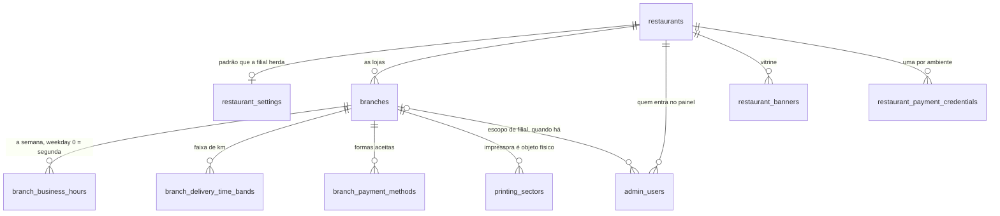
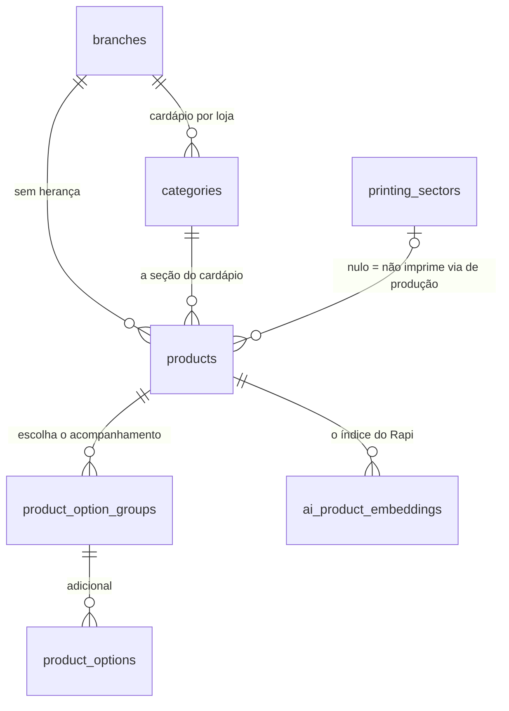
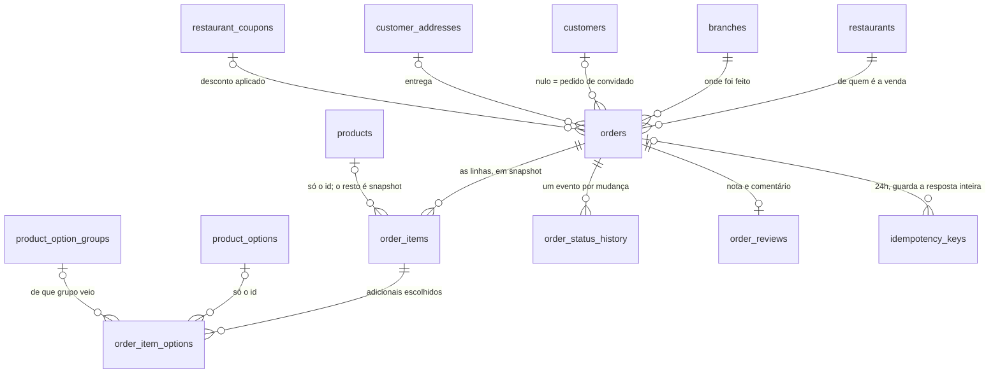
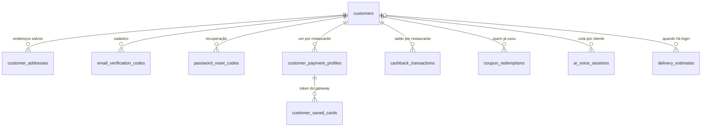
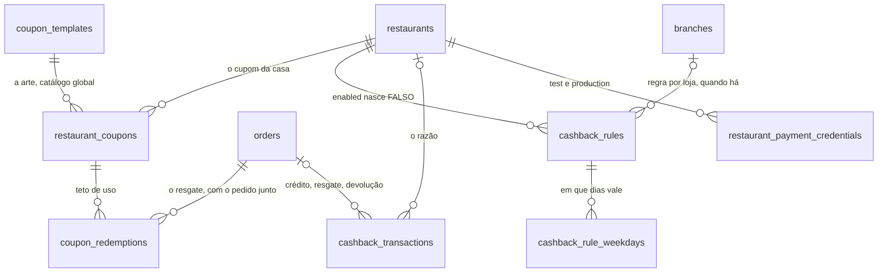
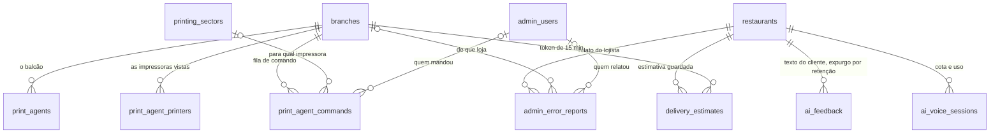

# Modelo de dados

40 tabelas mapeadas pelo ORM. Este documento cobre o que cada uma guarda, como
se ligam e por que o isolamento entre restaurantes funciona do jeito que
funciona.

A fonte da verdade do schema é `alembic/versions/`. A pasta `migrations/` tem os
12 `.sql` aplicados a mão antes do Alembic entrar — é arquivo histórico
congelado, **não rode nada de lá**.

---

## 1. O desenho geral

Seis diagramas e não um, e a razão é prática: 40 tabelas num `erDiagram` só
renderizam como um novelo em que nada se acha. O corte é por **assunto**, que é
como as perguntas chegam — "onde mora a taxa de entrega?", "o que o pedido
congela?" —, e cada tabela aparece no diagrama do dono dela.

Notação: `||` é obrigatório, `o|` é opcional (a FK aceita nulo), `o{` é muitos.
Então `branches |o--o{ admin_users` lê-se "um usuário do painel pode pender de
uma filial, e pode não pender de nenhuma".

**O que o Mermaid não consegue desenhar, e é justamente o que segura o
cardápio:** as quatro FKs COMPOSTAS de `products` e `categories`
(`(branch_id, category_id)`, `(branch_id, printing_sector_id)`,
`(restaurant_id, branch_id)`). Elas estão escritas por extenso na seção do
cardápio, mais abaixo — o diagrama mostra as pontas, e não o par.

### A raiz e a loja



`restaurant_settings` é 1:1 **opcional**, e os seis campos comerciais dela são
só o padrão: `NULL` na filial significa "herda" (§35 da skill). O estado do dia
— `is_open`, `accepts_delivery`, `accepts_pickup` — é `NOT NULL` na filial e
não herda nada.

### O cardápio, que é da filial



**`restaurant_id` continua nas duas tabelas e NÃO é o filtro.** Consultar
cardápio por restaurante devolve as lojas todas misturadas, com 200 e sem log.

### O pedido



As setas para `products` e `product_options` existem para o histórico continuar
navegável — **o valor exibido nunca sai delas.** Nome, preço unitário e preço do
adicional estão congelados em `order_items` e `order_item_options`, e
`unit_price_snapshot` **já vem com os adicionais somados** (§2 da skill).

### O cliente, que é global



`customers` não pende de `restaurants`, e é o único ramo assim: a conta é da
plataforma. O que é por restaurante é o **saldo** (`cashback_transactions`) e o
**perfil de pagamento** — e a credencial salva é do lojista, então o cartão de
uma loja não vale na outra.

### O dinheiro: cupom, cashback e gateway



`coupon_templates` é o único catálogo **global** do schema — ele guarda a arte e
o tipo, e o cupom que desconta é o `restaurant_coupons`. Os dois precisam
concordar no tipo e no valor.

### Impressão, IA e o resto



`ai_feedback` e o `comment` de `order_reviews` **não têm `customer_id`**, e nas
duas a retenção não é faxina de disco: é o mecanismo de exclusão (§38 da
skill). Esticar o prazo "porque disco é barato" troca uma coisa pela outra.

---

## 2. As tabelas principais

### O restaurante e suas lojas

| Tabela | Guarda | Notas |
|---|---|---|
| `restaurants` | nome, `slug` (UNIQUE), cores da marca, logo, `is_active`, `description`, `assistant_notes` | O `slug` é a identidade pública na URL. Os dois textos têm públicos **opostos**: `description` é a vitrine (sai em `RestaurantPublicResponse`), `assistant_notes` é o contexto do assistente de IA e não sai em resposta pública nenhuma |
| `restaurant_settings` | `min_order_value`, `service_fee_enabled/amount`, `estimated_delivery_time_min/max`, `default_delivery_fee`, `platform_commission_percent`, `voice_enabled` | **1:1 opcional.** Os seis primeiros são só o **padrão** que a filial herda — nenhum pedido os lê direto (ver `operacao-por-filial.md`) |
| `branches` | endereço, lat/lng, regras de entrega da loja (base, por km, piso, teto, raio), **`is_open` / `accepts_delivery` / `accepts_pickup`** e as sobrescritas comerciais | A taxa de entrega e a **operação do dia** são por filial. Nas colunas comerciais homônimas de `restaurant_settings`, **NULL significa "herda"** |
| `branch_business_hours` | uma linha por faixa de horário: `weekday`, `opens_at`, `closes_at`, `prep_time_min/max`, `is_closed` | **`weekday` 0 = segunda** (é o `datetime.weekday()` do Python) |
| `branch_payment_methods` | `payment_flow` (`online`/`delivery`), `method_type`, `label`, `enabled`, `earns_cashback` | É a fonte da verdade das formas de pagamento aceitas — e por isso "quais formas geram cashback" é coluna daqui, não lista nova |
| `printing_sectors` | `branch_id`, nome, `sort_order`, `is_active` | Pende de **filial**, porque impressora é objeto físico dentro de uma loja |
| `admin_users` | `restaurant_id`, `branch_id` (nullable), `role`, e-mail UNIQUE global | `role` ∈ owner, manager, attendant, print_agent |

### O cardápio

| Tabela | Guarda | Notas |
|---|---|---|
| `categories` | `restaurant_id`, **`branch_id`**, nome, `slug`, `sort_order`, `is_active` | Pende de **filial** desde a revisão `20260820_0026`. `slug` é único por `(branch_id, slug)` |
| `products` | `restaurant_id`, **`branch_id`**, `category_id`, `printing_sector_id` (**NULLABLE**), **`catalog_key`** (NULLABLE), `price`, `is_active`, `is_available` | Pende de **filial**: cada loja tem os próprios produtos e preços, sem herança. `printing_sector_id` nulo = **não gera via de produção** (decisão do lojista, não falta de configuração). `catalog_key` liga o mesmo item entre lojas e serve **só a relatório** |
| `product_option_groups` | `min_select`, `max_select`, `is_required`, `is_active` | Os "escolha o acompanhamento" |
| `product_options` | `additional_price`, `is_active` | |

**Nada é apagado no cardápio, só desativado** (`is_active=false`), porque
`order_items.product_id` referencia `products` por FK. Apagar um produto
quebraria pedidos antigos.

**O cardápio é da FILIAL, sem herança.** Não existe "produto do restaurante"
nem sobrescrita por loja: a picanha do Centro e a da Aldeota são duas linhas
independentes. Quatro FKs compostas garantem que as pontas não divirjam:

```
products (branch_id, category_id)        -> categories (branch_id, id)
products (branch_id, printing_sector_id) -> printing_sectors (branch_id, id)
products (restaurant_id, branch_id)      -> branches (restaurant_id, id)
categories (restaurant_id, branch_id)    -> branches (restaurant_id, id)
```

A segunda é a que torna **impossível de gravar** o produto de uma loja
apontando para a impressora de outra — o estado que a armadilha 13 do skill
descrevia. Documento completo: [`cardapio-por-filial.md`](cardapio-por-filial.md).

### O pedido

| Tabela | Guarda |
|---|---|
| `orders` | a linha central — ver detalhe abaixo |
| `order_items` | um item, com **snapshots**: `product_name_snapshot`, `unit_price_snapshot`, `total` |
| `order_item_options` | os adicionais escolhidos, também em snapshot (`option_name_snapshot`, `additional_price_snapshot`) |
| `order_status_history` | um evento por mudança: `status`, `changed_by`, `note` |

`orders` carrega, em blocos:

```
identidade      id, order_number (sequence GLOBAL, UNIQUE),
                tracking_token_hash (UNIQUE — sha-256; o token em claro
                nunca é gravado, ver revisões 0016/0017)
dono            restaurant_id (NOT NULL), branch_id, customer_id (NULLABLE)
snapshot        customer_name_snapshot, customer_phone_snapshot  (ambos NOT NULL)
operação        order_type, status, notes
dinheiro        payment_method, payment_flow, payment_status, paid_at,
                payment_provider, provider_payment_id
valores         subtotal, delivery_fee, service_fee, discount_total, total
desconto        coupon_id, coupon_code_snapshot, coupon_discount_amount,
                cashback_redeemed_amount
comissão        commission_percent, commission_base_amount, commission_amount
endereço        address_street/number/neighborhood/complement/reference/city/state/zipcode
entrega         delivery_latitude/longitude, delivery_distance_km,
                delivery_travel_time_min, delivery_prep_time_min/max,
                delivery_eta_min/max, delivery_estimate_provider, delivery_estimated_at
```

Por que tanto snapshot: o pedido tem que continuar legível se o cliente mudar de
nome, trocar o telefone ou apagar a conta, e se o lojista mudar o preço ou
renomear o produto. `customer_address_id` inclusive é `ON DELETE SET NULL` —
o endereço textual fica em colunas próprias do pedido.

### Cupom e cashback

| Tabela | Guarda | Notas |
|---|---|---|
| `coupon_templates` | catálogo GLOBAL de arte/tipo | |
| `restaurant_coupons` | `code`, `discount_type`, `discount_value`, `max_discount_amount`, limites e janelas | UNIQUE `(restaurant_id, code)` |
| `coupon_redemptions` | `coupon_id`, `customer_id`, `order_id`, `discount_amount`, `status` | UNIQUE em `order_id` **e** em `idempotency_key` |
| `cashback_transactions` | `customer_id`, `amount`, `type`, `status` | Ver o aviso abaixo |
| `cashback_rules` | `restaurant_id`, `branch_id` (NULL = padrão da rede), `enabled`, `default_percent`, `min_redeem_balance`, `expiry_days` | Herança por **linha**: a filial tem a regra inteira ou herda a inteira. Ver [cashback.md](cashback.md) |
| `cashback_rule_weekdays` | `rule_id`, `weekday` (0 = segunda), `percent` | O percentual do dia fraco. **Dia ausente herda `default_percent`**, nunca zero |

**O resgate de cashback está pela metade.** `cashback_redeemed` é literalmente
`ZERO` no cálculo do pedido, e `cashback_redeemed_amount` sempre grava zero. A
tabela existe, o saldo é lido e listado, e `CustomerRepository.lock_customer` já
está escrito para o resgate — mas ninguém o chama. O crédito ao completar pedido
também não existe. **O saldo que o cliente vê só muda se alguém escrever na
tabela por fora.**

A revisão `20260822_0032` põe o schema de pé (configuração, CHECK e índices do
razão) mas **não liga nada**: `cashback_rules.enabled` nasce falso em todo
restaurante. O desenho combinado — quando credita, como o resgate trava, como
expira — está em [cashback.md](cashback.md).

### Infraestrutura

| Tabela | Guarda | Notas |
|---|---|---|
| `idempotency_keys` | `scope`, `key`, `request_fingerprint`, `status`, `response_body` (JSONB), `expires_at` | UNIQUE `(scope, key)`. É esse índice que serializa as requisições concorrentes |
| `delivery_estimates` | `token` (UNIQUE), `address_fingerprint`, taxa/distância/ETA, `expires_at` | Reaproveitada na criação do pedido |
| `restaurant_payment_credentials` | `public_key`, `access_token_encrypted`, `webhook_secret_encrypted`, `environment` | Cifrados com Fernet. Uma linha por `(restaurant_id, environment)` |
| `admin_error_reports` | `description`, `error_log`, `screen`, `order_number`, e o `restaurant_id`/`branch_id`/`admin_user_id` que saem do TOKEN | O "deu erro" do painel. Credencial é mascarada antes do INSERT; o resto **vence em 90 dias**, e é assim que sai do banco — a tabela não tem `customer_id` (armadilha 38). `order_number` é número solto, sem FK: é o que uma pessoa digitou |

---

## 3. Como o isolamento entre restaurantes funciona

**Não há RLS nem schema por tenant.** O isolamento é filtro explícito por
`restaurant_id` em toda consulta, e ele mora nos **repositórios**.

Tabelas que carregam `restaurant_id` próprio: `branches`, `categories`,
`products`, `restaurant_settings`, `restaurant_banners`, `restaurant_coupons`,
`orders`, `admin_users`, `ai_product_embeddings`, `ai_feedback`,
`cashback_transactions`, `restaurant_payment_credentials`, `delivery_estimates`.

**Em `categories` e `products` o filtro que vale é `branch_id`**, e o
`restaurant_id` fica ao lado como redundância amarrada por FK composta:
consultar cardápio por restaurante devolve as lojas todas misturadas.

Duas defesas complementares:

1. **O `restaurant_id` do lojista vem sempre do token, nunca da URL.** Nenhuma
   rota `/admin` aceita restaurante como parâmetro. A listagem de pedidos aceitava
   um slug na URL e isso foi corrigido — uma rota que *recebe* restaurante é uma
   rota que pode esquecer de conferi-lo.
2. **Divergência responde 404, não 403.** Um 403 confirmaria que aquele
   `restaurant_id` existe. Para o lojista, o que não é dele simplesmente não
   existe.

`OrderRepository.get_order_detail` exige `restaurant_id` como parâmetro
obrigatório de propósito: enquanto o filtro era só por `Order.id`, qualquer
lojista com um UUID de pedido em mãos lia o pedido de outro restaurante, com
nome, telefone e endereço do cliente dentro.

O escopo **por filial** é a segunda camada, aplicada em
`api/dependencies/admin_scope.py`. Ver
[autenticacao-e-escopo.md](autenticacao-e-escopo.md).

---

## 4. Por que `customers` é global e `orders` pertence a um restaurante

**`customers` é global** porque a conta é do cliente, não do restaurante.
`email`, `phone` e `cpf` têm UNIQUE de tabela inteira — não existe
`customers.restaurant_id`.

Consequências práticas:

- Uma conta serve para pedir em qualquer restaurante da plataforma. É o modelo de
  marketplace (iFood), não o de app-por-restaurante.
- Endereços salvos e saldo de cashback são do cliente e atravessam restaurantes.
- O login busca por e-mail/telefone sem nenhum escopo de restaurante.
- **O mesmo CPF não se cadastra duas vezes**, nem para restaurantes diferentes.
  Se um dia a plataforma quiser contas separadas por restaurante, esses três
  UNIQUE são o que precisa mudar primeiro.

**`orders` pertence a um restaurante** porque um pedido é uma transação com
*aquele* estabelecimento: tem a filial que prepara, os produtos daquele cardápio,
a taxa daquela filial e o histórico que aquele lojista opera.
`orders.restaurant_id` é NOT NULL; `orders.customer_id` é NULLABLE porque pedido
de convidado é suportado.

**`orders.order_number` é uma sequence GLOBAL e UNIQUE na tabela inteira**, não
uma numeração por restaurante. O primeiro pedido de um restaurante novo pode ser
o número 5471. Se o lojista pedir numeração própria, isso é mudança de schema.

---

## 5. Índices: a convenção

O prefixo canônico é `ix_`. Índices criados a mão antes do Alembic usam outros
nomes (`idx_`), e adotá-los sob o nome da convenção é uma revisão própria — não
basta criar o novo com `IF NOT EXISTS`, porque **`IF NOT EXISTS` casa por NOME,
não por definição**: dois índices com nomes diferentes sobre a mesma coluna são,
para o Postgres, dois índices, mantidos os dois em toda escrita.

`scripts/audit_indexes.py` procura as duas coisas: colisão de nome e duplicata de
definição.

Ver também a armadilha do `if_not_exists` em
`.claude/skills/rapidex-backend/SKILL.md`.
