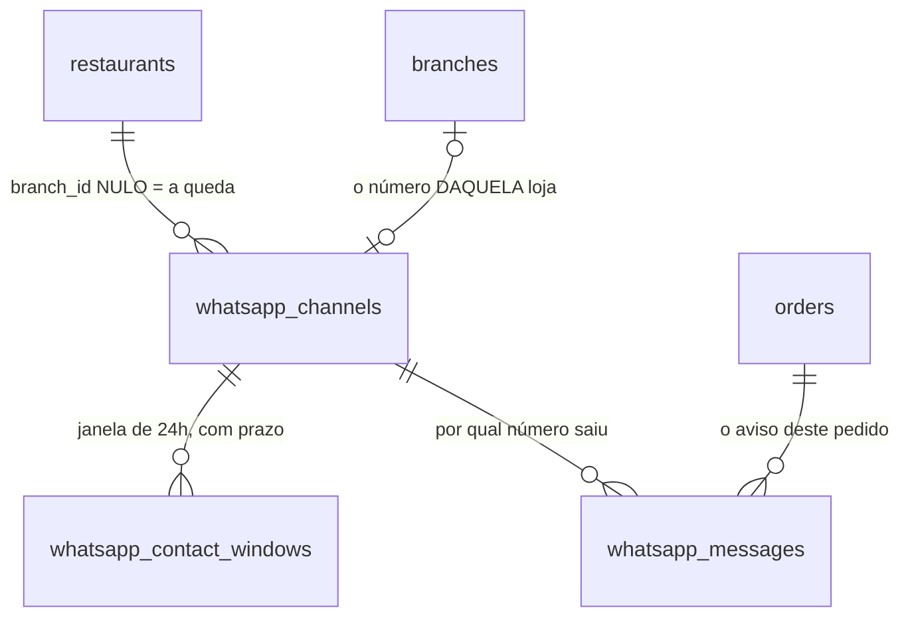

# WhatsApp

Cobre `integrations/whatsapp_client.py`, `services/whatsapp_webhook_service.py`,
`services/whatsapp_send_service.py`, `services/whatsapp_notification_service.py`,
`repositories/whatsapp_repository.py`, `api/endpoints/whatsapp.py`,
`scripts/register_whatsapp_channel.py`, `scripts/reenvia_avisos_de_whatsapp.py`,
`api/endpoints/admin_whatsapp.py`, `services/admin_whatsapp_service.py`
e as revisões `20260904_0051` a `20260905_0054`.

O que existe: **o cliente recebe aviso do próprio pedido pelo WhatsApp da
loja**, pela Cloud API oficial da Meta. Quatro avisos, sempre por template
aprovado, com registro do que saiu e reenvio do que falhou por algo que passa.

O painel conecta, lista e desconecta canal (§9.3). O que não existe: chatbot,
atendimento, resposta a mensagem recebida, e tela de aviso por pedido. Ver §10.

---

## 1. As três decisões que moldaram o resto

**O número é POR FILIAL, com queda no restaurante.** Filial com número usa o
dela; filial sem número usa o do restaurante. É o regime da herança
(`branches` × `restaurant_settings`, §35 da skill) dentro de **uma** tabela:
`whatsapp_channels.branch_id` nulo significa "esta linha é a queda do
restaurante", e só nulo significa isso.

**O webhook é ÚNICO para a aplicação inteira.** A Meta manda tudo para o mesmo
endereço; o roteamento é pelo `phone_number_id` que vem no payload. Webhook por
restaurante é o que fica caro mudar depois.

**O app da Meta é NOSSO, e é um só.** Daí sai o `WHATSAPP_APP_SECRET`, que
assina o webhook de todos os números. O `access_token` é do **lojista** (da
Business Manager dele) e mora cifrado, uma linha por número.

Essa divisão — segredo nosso global, credencial do lojista por linha — inverte
a ordem do webhook em relação à do pagamento. Ver §3.

---

## 2. As três tabelas



### 2.1 `whatsapp_channels` — o número

Uma linha por número conectado. `access_token_encrypted` é Fernet, com chave
**própria** (`WHATSAPP_TOKEN_ENCRYPTION_KEY`) e sem queda para a do pagamento —
são credenciais de terceiros diferentes, e rotacionar uma por causa de um
incidente do gateway obrigaria a recifrar as outras no mesmo minuto (§32).

As três travas, e o que cada uma impede:

| Trava | Impede |
|---|---|
| `UNIQUE (phone_number_id)` | o mesmo número roteando para dois destinos — e ninguém percebendo até o dia em que os dois divergem |
| `UNIQUE (branch_id)` | duas linhas para a mesma filial. `NULL` é distinto de `NULL` no Postgres, então isto **não** atrapalha as linhas de restaurante |
| índice único parcial `(restaurant_id) WHERE branch_id IS NULL` | dois "números do restaurante". É o que o `UNIQUE` comum não pega, justamente pela regra dos nulos acima |

**Por que tabela e não colunas em `branches` + `restaurant_settings`.** A
semântica seria a mesma, mas a pergunta principal aqui é a **inversa** da da
taxa de entrega: o webhook chega com um `phone_number_id` e precisa achar a
filial. Espalhado em duas tabelas isso vira dois `SELECT` e — o que importa
mais — **não existe `UNIQUE` que atravesse duas tabelas.**

### 2.2 `whatsapp_contact_windows` — a janela de 24h

Guarda `phone_e164` e `window_expires_at`, por canal. **Sem `customer_id`**: o
prazo é o mecanismo de exclusão (§38), e aqui ele já vem escrito na linha —
é a própria janela da Meta. O expurgo é `delete_expired`, no container
`limpeza`.

A escrita é `extend`, e ela usa `GREATEST` e nunca atribuição: **a Meta
reenvia webhook e entrega fora de ordem.** Um reenvio de mensagem antiga
chegando depois da nova desfaria, com atribuição, a janela que a nova abriu.

O relógio é o da **mensagem** (`sent_at`), não o nosso: um webhook que chega
meia hora atrasado não pode esticar a janela em meia hora.

### 2.3 `whatsapp_messages` — o que saiu, e se chegou

Sem esta tabela, "o cliente foi avisado" é suposição: a Meta aceita a chamada e
entrega depois, e o desfecho chega em outro webhook.

| Coluna | |
|---|---|
| `kind` | qual aviso, no NOSSO vocabulário (`order_accepted`, …). Espelha `WHATSAPP_MESSAGE_KINDS` num CHECK (§15) |
| `status` | `sent` → `delivered` → `read`, ou `failed` |
| `wamid` | o id da mensagem na Meta, `UNIQUE`. Nulo quando a chamada falhou antes de haver resposta — e `NULL` é distinto de `NULL`, então várias falhas convivem |
| `error_code` | por que não saiu. **Dois vocabulários**, e o prefixo separa: `132001` é código da Meta, `refused:phone` é recusa nossa |
| `attempts`, `next_attempt_at` | o reenvio. Ver §6 |

**Sem telefone nenhum aqui**: quem tem o telefone é o pedido.

`UNIQUE (order_id, kind)` fecha o aviso repetido — clique duplo, retry de rede,
a varredura — no banco, que é onde ele vale para todas as portas de uma vez.

---

## 3. O webhook, e a ordem que ele NÃO herda do pagamento

`GET /webhooks/whatsapp` (a verificação da Meta) e `POST /webhooks/whatsapp`.

| | pagamento | WhatsApp |
|---|---|---|
| de quem é o segredo da assinatura | do RESTAURANTE | **nosso** (App Secret) |
| dá para verificar antes de saber a origem? | não | **sim** |
| ordem | achar o pedido → achar a credencial → conferir | **conferir → rotear** |

No Mercado Pago, saber qual segredo usar exige antes saber de qual restaurante
é o pagamento. Aqui o segredo é um só, então **nada acontece antes da
assinatura**: `X-Hub-Signature-256`, HMAC-SHA256 sobre os **bytes crus** do
corpo, comparado com `hmac.compare_digest` (§18).

Corpo reserializado não bate — por isso a rota é `async def`, para pegar
`await request.body()`, e o service roda em threadpool.

### 3.1 Os códigos, e o que cada um diz

| Código | Quando | O que fazer |
|---|---|---|
| **200** `{"status":"ok"}` | roteado e aplicado | nada |
| **200** `ignored` / `unknown_number` | número que não é nosso, corpo que não entendemos, corpo vazio | ler o log: o `phone_number_id` e o número legível estão lá |
| **401** | assinatura inválida | é a única hipótese em que alguém tenta falar pelo número do lojista |
| **503** | `WHATSAPP_APP_SECRET` ausente | subir a API com a variável. **Não existe modo "aceita sem verificar"** |

**`phone_number_id` desconhecido responde 200, e isso é deliberado.** A Meta
retenta em cima de qualquer resposta que não seja 2xx e **desativa o webhook do
app** depois de falha sustentada — e o webhook é o mesmo para todos os
restaurantes. Devolver 5xx por um número que não é nosso troca um evento inútil
por um canal derrubado.

O caso que de fato cai aqui é **um número novo do próprio lojista**: "conectei
na Meta e esqueci de cadastrar do nosso lado". Por isso o log traz o
`display_phone_number` que vem no payload — é público, é o número comercial da
loja, e é o que permite cadastrar sem abrir o painel da Meta.

### 3.2 Um POST traz vários números

`entry[].changes[]`, cada `change` com o seu `phone_number_id`. Duas lojas do
mesmo WABA cabem no mesmo POST: **o roteamento é por `change`, não por
requisição.** Tratar a requisição como se fosse de um número só creditaria as
mensagens de uma loja a outra, sem erro nenhum.

### 3.3 O que o webhook faz com o que chega

- **mensagem do cliente** → abre/estica a janela de 24h. **O texto não é
  lido**: o que interessa é QUE ele escreveu, não O QUE escreveu — texto de
  pessoa é dado pessoal com prazo, e não há quem o leia;
- **status de entrega** → move a linha de `whatsapp_messages` pelo `wamid`, e
  só para a frente (`sent` 1 → `delivered` 2 → `read` 3 → `failed` 4). Um
  reenvio da Meta fora de ordem não faz um `read` voltar a `sent`;
- **`account_update`** → §7;
- **`wamid` que não conhecemos** → nada, e não é erro: o mesmo número pode ser
  usado por uma pessoa no painel da Meta.

---

## 4. Enviar: a janela de 24h decidida no envio

Duas formas, e a Meta só aceita a primeira dentro da janela:

- **texto livre** — só se o cliente escreveu para AQUELE número nas últimas 24h;
- **template aprovado** — sempre permitido, e o único caminho fora da janela.

**Os avisos de pedido são SEMPRE template**, e isso não é conservadorismo: o
cliente pediu pelo app e nunca escreveu no WhatsApp da loja, então a janela
está fechada em praticamente 100% dos pedidos. Um texto livre ali volta
`131047` e o cliente **não é avisado** — sem erro do nosso lado, porque a
resposta da Meta é um 400 que alguém precisa estar lendo.

**A decisão mora no `WhatsAppSender`, e não em quem chama** (§46: regra que
depende de alguém lembrar de aplicá-la é recomendação). `send_text` confere a
janela e **recusa** fora dela, em vez de tentar e falhar.

**A conversão para E.164 não inventa.** `normalize_digits` deixa só dígitos, e
a regra é fechada: 10 ou 11 dígitos ganham o `55`; 12 ou 13 começando com `55`
passam como estão; **qualquer outra coisa não é enviada** e vira
`refused:phone`. Chutar um DDI é mandar a mensagem de um cliente para o
telefone de outra pessoa.

**O telefone nunca vai para o log**, nem no caminho de erro. Quem identifica o
envio é `pedido=#N` e o `wamid`.

---

## 5. Os quatro avisos

Entram em `OrderStatusChangeService.apply`, **depois do commit e fora do
`try`** — mesmo lugar e mesmo motivo do estorno. Falar com a Meta não pode
fazer parte da transação do pedido: um timeout deles desfaria a mudança de
status, e quem clicou veria um erro com o pedido já na cozinha. O `except`
largo é o mesmo: a mudança **já está gravada**, e virar 500 diria ao lojista
que o aceite não aconteceu.

É esse ponto único que faz o aviso valer para as quatro portas de escrita de
status (painel, cancelamento, cliente, entregador) sem quatro cópias.

| Status do pedido | `kind` | template na Meta | vale em |
|---|---|---|---|
| `accepted` | `order_accepted` | `pedido_aceito` | entrega e retirada |
| `ready` | `order_ready_for_pickup` | `pedido_pronto_para_retirada` | **só retirada** |
| `out_for_delivery` | `order_out_for_delivery` | `pedido_saiu_para_entrega` | só entrega |
| `completed` | `order_delivered` | `pedido_entregue` | só entrega |

**Cada aviso vale nos tipos de pedido em que a FRASE dele é verdadeira**
(`_TIPOS_DE_PEDIDO_POR_AVISO`). São quatro frases diferentes, não quatro graus
de cautela:

- numa **entrega**, `ready` significa "pronto para SAIR", e quem vem buscar é o
  motoboy. Mandar "pronto para retirada" é mandar a pessoa buscar um pedido que
  vai até ela;
- numa **retirada**, `completed` é "a pessoa já veio buscar". Avisar ali é
  contar a ela o que ela acabou de fazer.

**As listas são positivas e escritas por extenso**, e não `ORDER_TYPES` (§47):
tipo de pedido novo cai fora de todas e nasce sem aviso nenhum. Um aviso
automático com a frase errada é pior que aviso nenhum, porque o cliente age com
base nele.

**O `kind` não é o nome do template.** `order_accepted` é nosso e está no CHECK
do banco; `pedido_aceito` é o nome aprovado na Meta e pode ser renomeado,
reaprovado ou trocado de idioma sem que o aviso deixe de ser "o pedido foi
aceito". `_TEMPLATE_POR_KIND` é a única costura entre os dois.

**A conferência antes do envio não é redundante com o `UNIQUE`.** O `UNIQUE`
barra a LINHA, e nesse ponto a mensagem já saiu. Quem protege o cliente de
receber duas é `exists_for`, antes da chamada.

**Os quatro templates têm as mesmas três variáveis, na mesma ordem** — nome do
cliente (só o primeiro), número do pedido, nome da loja. A Meta **não nomeia
parâmetro**: trocar dois de lugar manda o número do pedido onde vai o nome do
cliente, sem erro nenhum.

---

## 6. Quando o aviso não sai

Falha não vira exceção para quem chama: vira uma **linha `failed`**, que é o
registro de que o cliente não foi avisado e o único lugar onde isso é visível
depois.

### 6.1 O reenvio, e a decisão que ele NÃO toma

`next_attempt_at` é preenchido no `except`, onde o **tipo** da exceção existe:
`WhatsAppTransportError.retryable` é `True` (timeout, DNS, conexão),
`WhatsAppRejectedError` é `False` (§49). A varredura lê a coluna e **não olha o
`error_code`**.

Uma lista de "códigos retentáveis" na varredura seria a mesma pergunta com duas
respostas em dois arquivos. O caso concreto é o `132001`: template não aprovado
*parece* transitório, porque a aprovação chega em horas — mas quem aprova é uma
pessoa no painel da Meta, e retentar de dois em dois minutos gastaria a
validade inteira do aviso sem uma chance.

### 6.2 A validade, e as três desistências

**O aviso vale 30 minutos** (`VALIDADE_DO_AVISO`). Ele não é um dado, é um
recado sobre um instante: *"seu pedido foi aceito"* chegando com o pedido já
entregue não é um aviso atrasado, é um aviso **errado**. Aqui o erro caro é o
número grande — ao contrário da carência de `cancela_pedidos_sem_pagamento.py`,
onde o erro caro é o curto.

`WhatsAppOrderNotifier.retry` desiste em três casos, todos sobre o que mudou
entre a falha e agora:

1. **validade vencida**;
2. **pedido `cancelled` ou `rejected`** — mandar "foi aceito" para quem teve o
   pedido cancelado deixa o cliente esperando comida que não vem;
3. **canal sem número utilizável** — o canal é **resolvido de novo**, e não
   lido do `channel_id` da linha: entre a falha e o reenvio o lojista pode ter
   desconectado a Cloud API (§7).

**As três moram no service, não na varredura.** São regra de domínio; a
varredura é agendamento. Se morassem lá, um botão de "reenviar" no painel — um
dia — teria que lembrar de repeti-las (§46).

**O reenvio ATUALIZA a linha**, porque `UNIQUE (order_id, kind)` diz que um
aviso tem uma linha. Inserir outra seria o banco recusando o registro **depois**
de a mensagem já ter saído.

### 6.3 Lendo a tabela depois

```sql
SELECT kind, status, attempts, error_code, next_attempt_at, wamid
FROM whatsapp_messages
ORDER BY created_at DESC LIMIT 20;
```

| O que se vê | O que significa |
|---|---|
| `sent`, `attempts=1` | saiu de primeira. `delivered`/`read` chegam depois, pelo webhook |
| `sent`, `attempts=3` | falhou duas vezes e o reenvio salvou |
| `failed`, `next_attempt_at` preenchido | na fila, vai ser retentado |
| `failed`, `next_attempt_at` nulo, `attempts=1` | **nunca foi retentável** — ver o `error_code` |
| `failed`, `next_attempt_at` nulo, `attempts>1` | tentou e **desistiu**. O motivo está no log, com o `pedido_id` |

O `error_code` da falha original **não é sobrescrito** ao desistir: ele é a
causa, e "desisti" é o desfecho. Trocar um pelo outro apagaria a única pista.

| `error_code` | O que fazer |
|---|---|
| `132001` | o template não está aprovado, ou o nome não bate. É operação no painel da Meta |
| `131047` | texto livre fora da janela. Não deveria acontecer: os avisos são template |
| `refused:phone` | o telefone do pedido não vira E.164. É cadastro do cliente |
| `refused:window` | o mesmo `131047`, recusado antes da chamada |

---

## 7. Quando o lojista desconecta

`account_update` com `PARTNER_REMOVED` é a Meta avisando que o lojista tirou o
acesso da Cloud API pelo aplicativo dele. Sem tratá-lo, o número para de
funcionar **em silêncio**.

**O evento é da CONTA, e não de um número**: a chave é o `waba_id`, e todos os
canais daquele WABA são marcados juntos (`disconnected_at`,
`disconnect_reason`). Marcar só um deixaria os outros tentando enviar contra um
acesso que não existe mais.

**"Dá para mandar por este canal" são DUAS condições**, e elas não se
substituem: `is_active` (eu não desliguei) e `disconnected_at IS NULL` (a Meta
não tirou o acesso). A resposta é uma só, em `_canal_utilizavel` (SQL) e
`canal_utilizavel` (Python) — as duas formas moram lado a lado de propósito
(§54).

**O número da filial desligado NÃO cai no do restaurante.** Cair seria a loja
passando a falar por outro número sem ninguém ter pedido; o que se espera de um
número desligado é que a loja pare de mandar.

**Já desconectado não é reescrito**: a Meta reenvia webhook, e sobrescrever
moveria o `disconnected_at` para a frente a cada reenvio, apagando a hora em
que a desconexão de fato aconteceu.

**Religar é recadastrar.** `scripts/register_whatsapp_channel.py` limpa
`disconnected_at` no conflito, porque quem roda o script de novo está com um
token novo em mãos — e o token novo só existe porque o lojista religou o
acesso.

O rastro é a linha do banco mais um **WARNING** com os números que pararam. Não
há tela.

---

## 8. Coexistência: o que é ignorado de propósito

Três campos de webhook — `smb_message_echoes` (o que o atendente humano
respondeu do celular), `smb_app_state_sync` e `history` — só existem quando a
coexistência está ligada, e ela exige Embedded Signup / Tech Provider.

Hoje eles são **ignorados com trava** (`tests/test_whatsapp_coexistencia.py`).
A trava importa porque `smb_message_echoes` chega com `message_echoes` e não
`messages`: sem o teste, o dia em que a coexistência ligar seria o dia em que a
janela de 24h passaria a ser aberta por mensagem que a **loja** mandou.

Se um dia o eco do atendente precisar aparecer em algum lugar nosso, ele entra
como dado pessoal com prazo — e não como mais uma coluna.

---

## 9. Operação

### 9.1 O `.env`

| Variável | De onde vem | Vazia, o que acontece |
|---|---|---|
| `WHATSAPP_APP_SECRET` | app da Meta (nosso) | webhook responde **503** |
| `WHATSAPP_WEBHOOK_VERIFY_TOKEN` | **eu invento**, e colo nos dois lados | `GET` responde 503, e o painel da Meta só diz que não validou |
| `WHATSAPP_TOKEN_ENCRYPTION_KEY` | `Fernet.generate_key()` | o cadastro do canal falha |
| `WHATSAPP_NOTIFICATIONS_ENABLED` | nossa | **falso por padrão**: nenhum aviso sai, e o reenvio também não |

`WHATSAPP_NOTIFICATIONS_ENABLED` nasce falsa pelo mesmo desenho de
`cashback_rules.enabled` (§26): quem liga envio para telefone de cliente de
verdade liga de propósito. E, no dia do aviso duplicado, desligar é uma
variável e um restart — não um `UPDATE` de madrugada em cada restaurante.

A versão do Graph é **fixa** (`v21.0`) e não "a mais recente": a Meta muda
formato de payload entre versões, e a hora de descobrir isso não é no meio do
almoço.

### 9.2 Cadastrar um número

```
docker exec -it pedeaqui-api python scripts/register_whatsapp_channel.py \
    --restaurant-slug junior-da-picanha \
    --branch-slug centro \
    --waba-id 1234567890 \
    --phone-number-id 9876543210 \
    --display-phone-number "+55 85 99999-0000"
```

**Sem `--branch-slug`**, a linha é a do RESTAURANTE — a queda usada por toda
filial que não tem a sua.

**O token não é argumento de linha de comando** (ficaria no histórico do shell e
no `ps`): vem por prompt oculto, e o `-it` é o que faz o prompt aparecer.

**Use o token do usuário do sistema, não o de 24 horas.** O que aparece em
*WhatsApp → Configuração da API* é temporário: com ele os avisos param sozinhos
no dia seguinte, sem nada errado do nosso lado.

**Rodar de novo troca o token do mesmo número** — o conflito é pelo
`phone_number_id`, e recadastrar é a rotação de token. Trocar o NÚMERO de uma
loja é outra coisa: apague a linha antiga antes.

### 9.3 Conectar pelo painel

`/admin/whatsapp/channels` faz pelo lojista o que a §9.2 faz por script. Ler é
`GERENCIA`; conectar e desconectar são `SOMENTE_DONO` — conectar cola no nosso
banco uma credencial da Business Manager **dele**, e desconectar cala os avisos
sem que nada quebre visivelmente.

**`GET` devolve duas listas, e a segunda é a razão de a rota existir.**
`channels` são as linhas; `branches` responde *"por qual número ESTA loja
fala?"*, com `source` (`branch` / `restaurant` / `none`) e `can_send`. Sem ela,
a filial que **herda** o número do restaurante apareceria como "sem WhatsApp", e
o dono desligaria uma campanha que estava no ar. `can_send` sai de
`resolve_for_branch` — a mesma consulta do envio, nunca um `if` equivalente
(§54).

`?branch_id=` restringe a uma loja, e **nunca amplia**: passa por
`resolve_branch_filter`, então quem está preso a uma filial e pedir outra recebe
404. Filtrado, `channels` mantém a linha do restaurante — sem ela a tela diria
"você herda um número" sem ter o número para mostrar.

**A tabela de estados, e ela mora no backend.** O `status` é o código que o
painel usa para decidir; `status_label` e `status_action` são a frase que a
pessoa lê. É a divisão da §49: código não é mensagem, e tela que monta a frase a
partir do enum cai no `default` do `switch` no dia em que entrar um quarto
estado.

| `status` | `status_label` | `status_action` | quem conserta |
|---|---|---|---|
| `connected` | Conectado | `null` | ninguém — `null` quer dizer "está certo" |
| `disabled` | Desligado no painel | conecte o número de novo | **nós**, aqui mesmo |
| `disconnected_by_meta` | Desconectado pela Meta | reconecte no WhatsApp da loja **primeiro**, depois aqui | **o lojista**, fora daqui |

O terceiro é o que precisa gritar: é o único cujo conserto não é nosso, e
confundi-lo com `disabled` faz o dono clicar em "conectar" e continuar sem
receber nada. `disconnect_reason` leva o texto cru da Meta (`PARTNER_REMOVED`),
que é o que se cita num chamado com o suporte deles.

**`POST` com o mesmo `phone_number_id` é RECONECTAR** — troca o token, religa e
limpa a desconexão. É a rotação de token e a volta depois de um `DELETE`; sem
ele, desconectar seria irreversível pelo painel. As colisões respondem **409 com
frase** (número de outro restaurante, sem dizer de quem é; número de outra
filial sua, nomeando-a; lugar ocupado, dizendo por qual número). O índice cobre;
a rota explica.

**`DELETE` desativa e devolve 200 com o canal** — ver §9.6.

### 9.4 Desconectar, e o que fica

`DELETE /admin/whatsapp/channels/{id}` põe `is_active = false`. **A linha não é
apagada**, e não é escrúpulo: `whatsapp_messages.channel_id` é FK **sem
`ON DELETE`**, então o banco recusaria o DELETE assim que houvesse uma mensagem
— e apagá-la seria apagar o registro de que o cliente foi avisado.

As janelas de 24h ficam, e vencem sozinhas no expurgo do `limpeza`. O prazo
delas já **é** o mecanismo de exclusão (§38); apagá-las aqui seria um segundo
mecanismo para a mesma coisa.

O que muda no commit: `resolve_for_branch` para de escolher o canal. E a filial
que falava por um número **próprio** desligado **não cai** no do restaurante.

### 9.5 Os containers

| Container | Cadência | O que faz |
|---|---|---|
| `pedeaqui-api` | — | webhook e envio dos avisos |
| `whatsapp-reenvio` | **2 min** | `scripts/reenvia_avisos_de_whatsapp.py` |
| `limpeza` | 24h | expurga a janela de 24h vencida |

**Por que o reenvio tem container próprio.** Mesmo argumento que o `estorno` usa
contra morar no `limpeza`: cadência. Nos 15 min do `estorno` sobrariam uma ou
duas tentativas dentro dos 30 minutos de validade — pegaria a queda longa e
perderia a curta, que é justamente a comum. O caminho feliz não custa nada: a
consulta lê um índice **parcial**, e as linhas com retentativa marcada são uma
franja de uma tabela em que quase tudo é `sent`.

A varredura sai com **0 mesmo deixando aviso pendente**. A Meta fora do ar é o
cenário para o qual ela existe, e ela não pode ser também o que derruba o laço.
Código diferente de 0 significa banco fora do ar.

`--dry-run` lista o que seria reenviado sem mandar nada.

### 9.6 Conferir que funcionou

Na ordem, e cada passo responde o que o anterior não responde:

1. **o webhook chegou?** `docker logs pedeaqui-api | grep "\[WhatsApp\]"`.
   Mandar uma mensagem do próprio celular para o número da loja. Se aparecer
   `numero desconhecido`, o canal não está cadastrado — e a linha já traz o
   `phone_number_id` e o número legível;
2. **a janela abriu?** `SELECT channel_id, window_expires_at FROM
   whatsapp_contact_windows;` Uma linha prova o caminho inteiro: assinatura
   conferida, número roteado, escrita feita;
3. **o aviso saiu?** Aceitar um pedido de teste e ler `whatsapp_messages`
   (§6.3). **Nenhuma linha** significa `WHATSAPP_NOTIFICATIONS_ENABLED` falsa
   ou canal ausente para aquela filial — as duas aparecem no log.

**O que não dá para conferir daqui:** se a mensagem ficou bonita. `read` diz que
abriram, não que ficou boa.

---

## 10. O que NÃO existe

- **A tela do aviso por pedido.** O painel conecta e desconecta canal (§9.5),
  mas "o cliente recebeu?" continua só em `SELECT` sobre `whatsapp_messages`.
  É o próximo item natural.
- **Token vencido não aparece em lugar nenhum.** O `status` diz `connected` até
  o primeiro envio falhar, e aí o sintoma é `error_code` na tabela de mensagens
  — não a tela de canais. Conferir isso exigiria uma chamada ao Graph que hoje
  não existe.
- **Chatbot / atendimento.** Quem escrever para o número não recebe nada. E
  isso é deliberado: o plano é ligar o assistente a esse número depois, e uma
  resposta automática de "ninguém atende aqui" seria construir para jogar fora.
  A janela de 24h que a mensagem dele abre **fica gravada**, pronta.
- **Onboarding automático (Tech Provider / Embedded Signup).** Muda só de onde
  o token chega; a coluna é a mesma. Mas ele é o único caminho para a
  **coexistência** — e a coexistência é o que decide se o lojista aceita ligar
  o número que ele já usa para atender.
- **Reenvio de recusa da Meta.** Um `132001` não fica marcado, então corrigir
  um nome de template errado no nosso lado **não ressuscita** os avisos que já
  falharam. É o preço de não retentar o que uma repetição não conserta, e o
  remédio é manual.
- **Reserva de linha na varredura.** A suposição é UMA varredura: um container,
  um laço sequencial. Duas simultâneas custariam o cliente recebendo o mesmo
  aviso duas vezes — linha duplicada, não: disso o `UNIQUE` dá conta.
- **Falha reportada pelo webhook não é retentada.** Uma linha que saiu `sent` e
  depois virou `failed` pelo webhook de status tem `next_attempt_at` nulo. Não
  é descuido: ali a Meta aceitou a chamada, e o que falhou foi a entrega ao
  aparelho — repetir o mesmo template não é obviamente o remédio.
- **O opt-in no checkout do app.** A Meta exige que o cliente tenha consentido
  em receber mensagem. É uma linha no app, não no backend — e sem ela o risco é
  a qualidade do número cair por denúncia, que é o que derruba o canal.
